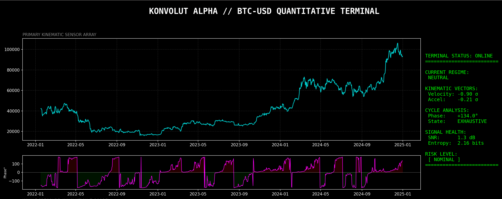
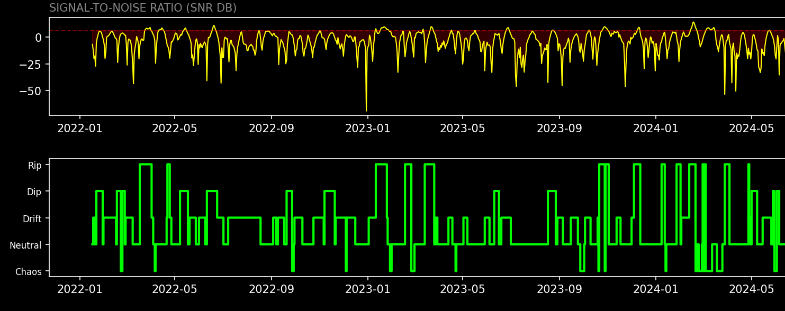

# Impulse-X: Scientific Precision for Disciplined Traders



**Impulse-X** is a high-performance terminal that brings institutional-grade kinematic analysis to the independent trader. 

---

## Stop Chasing Lag. Start Decoding the Market.

Most traders fail because they use indicators built on "Past Price." Impulse-X treats the market as a physical system in motion, utilizing probability models to map the terrain. By measuring the velocity of capital flow and filtering out the noise, you can identify regime shifts before the crowd.

### The Engine's Core Architecture

**1. The HMM Regime Decoder (The Core Edge).**
Markets don't just go "up" or "down"—they shift through hidden states of liquidity and volatility. Impulse-X features a synchronized Hidden Markov Model (HMM) decoder. Instead of guessing, the HMM mathematically assigns the current market action into one of five distinct regimes:

* *Neutral*
* *Constant Velocity (Bull Drift)*
* *Kinematic Dip (Mean-Reverting)*
* *Kinetic Rip (Mean-Reverting)*
* *High Chaos*

**2. Instantaneous Kinematics.**
We don't just look at price; we look at its physics. The engine calculates the true velocity and acceleration of the market. We also apply a Hilbert Transform for causal instantaneous phase extraction, allowing us to see the market's true cyclical position without look-ahead bias. 

**3. Signal Entropy & Noise Filtration.**
Not all price action is worth trading. The engine calculates Shannon Entropy to measure signal noise. When chaos is too high, the system tells you to sit on your hands.


---

## Terminal Environment Preview

The engine provides a clean, zero-distraction CLI output for rapid decision support.

```text
> [IMPULSE-X] INITIALIZING...
> [HMM] CURRENT REGIME: KINEMATIC DIP (Mean-Reverting)
> [KINEMATICS] Velocity: +2.4σ | Accel: +0.8σ
> [CYCLE ANALYSIS] Phase: 134.0° | State: Exhaustive
> [SIGNAL HEALTH] SNR: 1.3 dB | Entropy: 2.16 bits.
> [MARKET CONDITION] RISK LEVEL: NOMINAL
```

---

## Is This For You?

**This tool is NOT for:**

* Traders looking for "Buy/Sell" alerts.
* People who want a "get rich quick" magic button.

**This tool IS for:**

* **Disciplined Traders** who want objective data to back their risk management.
* **Quant-Curious Minds** who respect mathematics but want a ready-to-use tool.
* **Independent Professionals** who need a "second opinion" grounded in physics and signal processing.

---

[Secure your Alpha Seat on Gumroad](https://konvolut.gumroad.com/l/wjtou)
